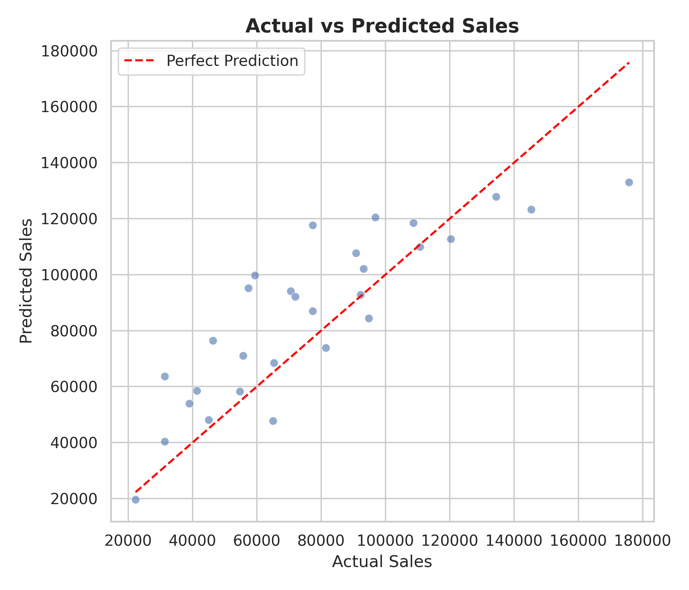
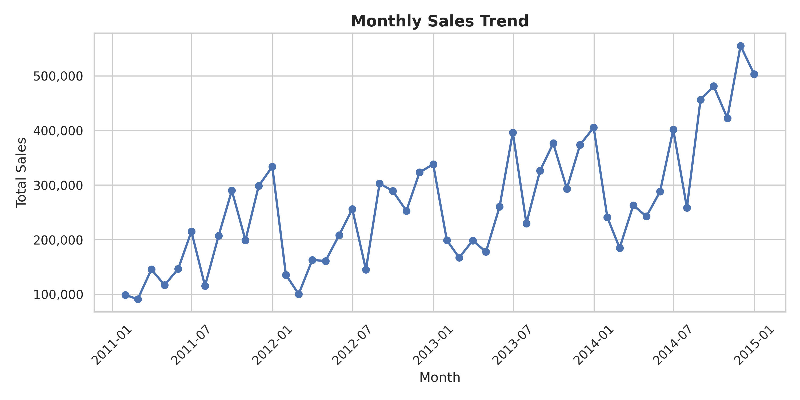
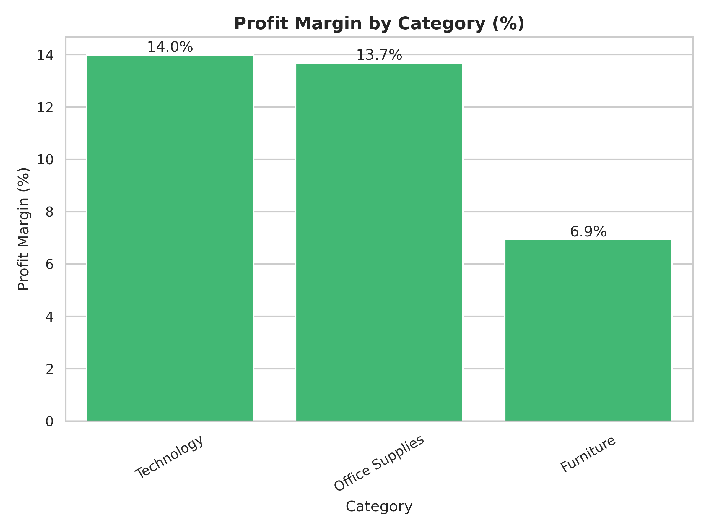

# Sales Analysis and Forecasting

This project analyzes sales performance using the Global Superstore dataset, combining exploratory data analysis (EDA) with predictive modeling to extract insights and support data-driven decision-making.

## Project Overview

The project is divided into two main stages:

### 1. Exploratory Data Analysis (EDA)
      Data exploration and cleaning
      Sales and profit analysis
      Profitability by category
      Time series analysis (sales trends and seasonality)
      Identification of top-performing products

### 2. Sales Forecasting (Machine Learning)
      Data preparation for modeling
      Feature engineering
      Model training and evaluation
      Sales prediction

## Key Insights
    - The business shows a consistent upward trend in sales over time.
    - Strong seasonal patterns are observed, with peaks at the end of the year.
    - Technology is the leading category in both revenue and profitability.
    - Furniture generates high sales but has significantly lower profit margins.
    - Revenue is distributed across multiple high-performing products, with technology items   dominating the top positions.

## Tools & Technologies
    Python
    Pandas
    Matplotlib / Seaborn
    Jupyter Notebook
    Scikit-learn

## Dataset
Global Superstore dataset (cleaned version for analysis)

[Download dataset](https://github.com/itsSolG/sales-analysis-and-forecasting/blob/main/data/superstore.csv)

## Objective
To understand sales behavior, identify key business insights, and build a predictive model to estimate future sales.

## Sample Visualizations

### Sales Forecasting

  

This visualization compares actual sales with the values predicted by the machine learning model. The results show a clear positive relationship between actual and predicted values, indicating that the model is able to capture the overall trend in the data. Most predictions are close to the ideal diagonal line, which suggests a reasonable level of accuracy.
However, some dispersion is observed, particularly for higher sales values, where the model tends to underestimate actual results. This indicates that while the model performs well in general, it has limitations when handling extreme cases.
Overall, the model provides a useful approximation of sales behavior and can support data-driven decision making.

### Monthly Sales Trend

  

This visualization shows the evolution of total sales over time on a monthly basis.
The trend highlights variations in sales performance across different periods, making it possible to identify patterns such as growth, decline, or potential seasonality. These fluctuations provide valuable insights into how demand changes over time.
Understanding these trends can help businesses anticipate future behavior and make more informed strategic decisions.

### Profitability Analysis

  

This chart presents the profit margin by category, allowing a comparison between how much each category sells and how much it actually earns.
The analysis reveals that high sales do not always translate into high profitability. Some categories generate strong revenue but have lower margins, suggesting inefficiencies such as higher costs or aggressive pricing strategies.
By focusing on profit margin instead of only sales volume, this visualization provides a deeper understanding of business performance and helps identify more profitable segments.
